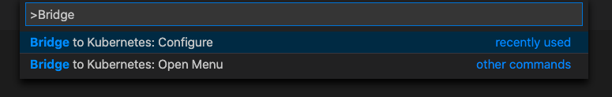
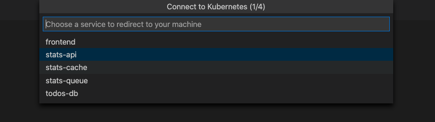
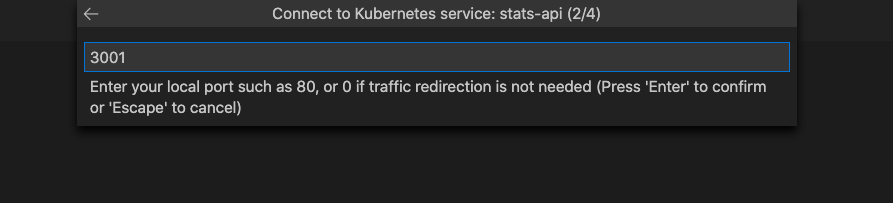
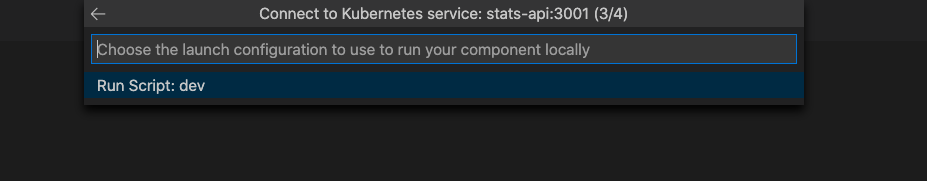
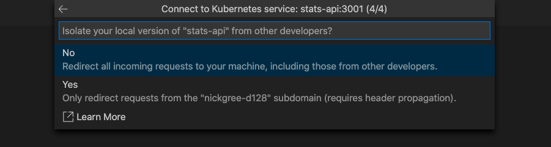
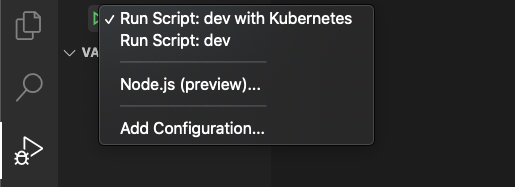
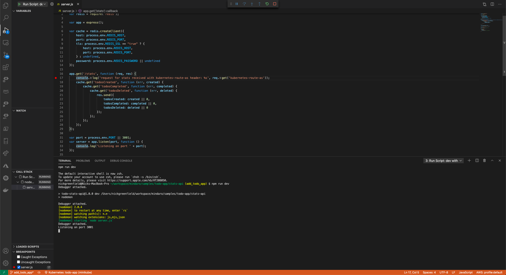
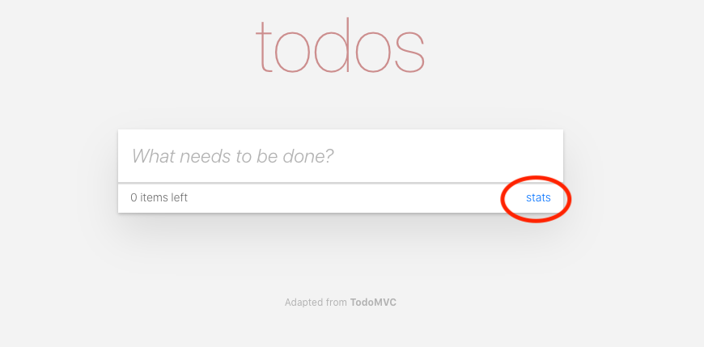

# TODO Application Sample with Ingress

This sample illustrates how Bridge to Kubernetes can be used to develop a microservice version of the celebrated TODO application on any Kubernetes cluster. This sample has been adapted from code provided by [TodoMVC](http://todomvc.com).

Most sample TODO applications are composed of a frontend and some kind of backend persistent storage. This extended sample adds a statistics component and breaks the application into a number of microservices, specifically:

- The frontend calls the database-api to persist and update TODO items;
- The database-api service relies on a Mongo database to persist TODO items;
- The frontend writes add, complete and delete events to a RabbitMQ queue;
- A statistics worker receives events from the RabbitMQ queue and updates a Redis cache;
- A statistics API exposes the cached statistics for the frontend to show.

In all, this extended TODO application is composed of six inter-related components.

## Prerequisites

- Kubectl CLI (connected to a cluster)
- [Bridge to Kubernetes VS Code extension](https://aka.ms/bridge-to-k8s-vsc-extension)

## Deploy the application

In this example, we will use a local cluster, MiniKube.

First, create a namespace for the sample.

```
kubectl create namespace todo-app-ingress
```

Then, apply the deployment manifest:

```
kubectl apply -n todo-app-ingress -f deployment.yaml
```

This is a simple deployment that exposes the frontend using nginx ingress. Wait for all the pods to be running and for the ingress to become available.

If you are testing with MiniKube, you will need to use `minikube tunnel` to resolve an external IP.

```
kubectl get services -n todo-app-ingress

NAME          TYPE           CLUSTER-IP     EXTERNAL-IP      PORT(S)        AGE
frontend      ClusterIP   10.0.49.177    127.0.0.1   80:30145/TCP   18h
```

To get the ingress use the following 
```
kubectl get ingress -n todo-app-ingress

NAME           CLASS   HOSTS                 ADDRESS          PORTS   AGE
todo-ingress   nginx   todoapp.ingress.com   20.237.125.234   80      8m30s
```

Browse to the application using the ingress `todoapp.ingress.com` and give it a spin. As you add, complete and delete todos, notice that the stats page updates with the expected metrics

## Debug the stats-api service

We will now use the Bridge to Kubernetes extension to demonstrate how traffic from the Kubernetes cluster can be redirected to a locally running version of the stats-api. 

```
cd stats-api/
```

Open the source code for the stats-api in VS Code.

```
code .
```

Once VS Code has opened, install dependencies by running npm install in a terminal window (CTRL + ~).

```
npm install
```

Next, place a breakpoint on line 17 of server.js.

Open the `Command Pallette (Ctrl + SHIFT + P) or (CMD + SHIFT + P)` and type Bridge to Kubernetes. Select the `"Bridge to Kubernetes: Configure"` option.



You are prompted to configure the service you want to replace, the port to forward from your development computer, and the launch task to use.

Choose the `stats-api` service. 


After you select your service, you are prompted to enter the TCP port for your local application. For this example, enter `3001`.


Choose `Run Script: dev` as the launch task.


You have the option of running isolated or not isolated. If you run isolated, only your requests are routed to your local process; other developers can use the cluster without being affected. If you don't run isolated, all traffic is redirected to your local process. For more information on this option, see [Using routing capabilities for developing in isolation](https://docs.microsoft.com/en-us/visualstudio/containers/overview-bridge-to-kubernetes?view=vs-2019#using-routing-capabilities-for-developing-in-isolation). For this example, we will proceed with non-isolated.


> Note: You will be prompted to allow the EndpointManager to run elevated and modify your hosts file.

The Bridge to Kubernetes debugging profile has been successfully configured.

Select the Debug icon on the left and select `Run Script: dev with Bridge to Kubernetes`. Click the start button next to `Run Script: dev with Kubernetes`.



Your development computer is connected when the VS Code status bar turns orange and the Kubernetes extension shows you are connected. Once your development computer is connected, traffic starts redirecting to your development computer for the stats-api you are replacing.




Navigate to the frontend ingress path of your todo-app using following command. 

```
kubectl get ingress -n todo-app-ingress

NAME           CLASS   HOSTS                 ADDRESS          PORTS   AGE
todo-ingress   nginx   todoapp.ingress.com   20.237.125.234   80      8m30s
```

For minikube, we'll be using `127.0.0.1`.

Make a request to the stats-api by clicking on the `stats` link. 



Notice the traffic that initally started in your cluster was redirected to your locally running version (outside of the cluster) where the breakpoint was triggered. 

Press play and let the request contine complete transparently.

This is just one example on how to use Bridge to Kubernetes on non-AKS clusters.  Try it on your own project next!

## Clean up

To clean up the assets produced by this sample, simply run:

```
kubectl delete namespace todo-app
```
