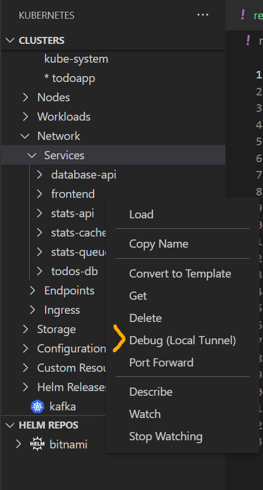

# Bridge to Kubernetes Testing Instructions

* [Visual Studio](#vs)
    * [Instructions](#instructions-vs)
    * [Setup](#setup-vs)
    * [Bridge to Kubernetes](#bridge-vs)
    * [KubernetesLocalProcessConfig.yaml](#custom-vs)
* [Visual Studio Code](#vscode)
    * [Instructions](#instructions-vscode)
    * [Setup](#setup-vscode)
    * [Bridge to Kubernetes](#bridge-vscode)
    * [Bridge to Kubernetes with Routing](#bridge-routing-vscode)
    * [KubernetesLocalProcessConfig.yaml](#custom-vscode)
    * [External Endpoints](#external-vscode)
    * [Https Ingresses](#https-vscode)
    * [Use Kubernetes Service Environment Variables](#k8s-svc-env-vars-vscode)
    * [Pod identity/Managed Identity](#podidentity)
    * [Kubernetes Extension Integration](#k8s-integration)
    * [Dapr](#dapr)

# <b id="vs">Visual Studio</b>

## <b id="instructions-vs">Instructions</b>
Please test these scenarios in this order to ensure that the Bridge to Kubernetes feature is fully tested in VS.
1. [Bridge to Kubernetes, non-isolated](#bridge-vs)
2. [Bridge to Kubernetes, isolated](#bridge-vs)
3. [KubernetesLocalProcessConfig.yaml](#custom-vs)
4. [Test with https ingresses](#https-vscode)
5. [Test with Pod identity/Managed Identity](#podidentity)

## <b id="setup-vs">Setup</b>
**Prerequisite**
1. Use Visual Studio 2019.
2. Install the Bridge to Kubernetes extension: https://marketplace.visualstudio.com/items?itemName=ms-azuretools.mindaro.

**Install sample application**
1. Install the Todo App sample application. Note below assumes you have a local or remote Kubernetes cluster created and it has a todo-app namespace.
    ```
    git clone https://github.com/Azure/Bridge-To-Kubernetes
    cd Bridge-To-Kubernetes/samples/todo-app
    kubectl apply -f deployment.yaml --namespace todo-app
    ```
2. Navigate to public URL `http://EXTERNAL_IP.nip.io` and verify the app works by entering a task or going to stats page.

## <b id="bridge-vs">Bridge to Kubernetes</b>
**Connect a service**
1. Open `Bridge-To-Kubernetes/samples/todo-app/` folder from the TodoApp sample application in Visual Studio. 
2. Select _Container in Kubernetes_ option from the debug dropdown menu.
3. Edit the app properties for the _Container in Kubernetes_ launch profile.
    * Select your subscription and cluster.
    * Select the namespace _todo-app_.
    * Select the service _stats-api_.
    * Select the launch profile _app_.
    * If you are testing isolated mode, make sure to check "Enable routing isolation" box.
    * Enter browser link `http://EXTERNAL_IP.nip.io`.
4. Hit _Ok_ and save your changes.

**Debug a service**
1. Open `server.js` in stats-api and set a breakpoint at line 25.
2. Navigate to the sample application by opening the public URL. 
3. Click the stats link. 
4. Return to Visual Studio and observe the breakpoint at line 25 has been hit. Hit _F5_ to resume the service.
5. Verify the log statement appears in the output.
6. Remove the breakpoint at line 25.

**Update application**
1. Right before line 26 enter below line:
    ```
    created = 20;
    ```
2. Save your changes and click _Run_ then _Restart Debugging_. 
4. After you are reconnected, verify the updated created count shows up when you refresh stats page.

**Automatically disconnect and restore**
1. Click _Run_ then _Stop Debugging_ to stop the debugger.
2. Verify that the original log statement appears in the output.

**Reconnect and manually disconnect the service**
1. Open the settings go to Tools -> Options -> Kubernetes Debugging Tools -> Settings.
2. Set _Bridge to Kubernetes_ -> _Disconnect After Debugging_ to False to STOP automatically disconnecting the service in the future.
3. Click on the start button next to _Bridge to Kubernetes_. Verify you are NOT prompted for service name, port, or launch task.
4. Click _Run_. Refresh the Todo app page and verify that you see the updated log statement in the output.
5. Click _Stop Debugging_. Refresh the Todo app page and verify that you see a Bad Gateway error in the output.
6. Click on the _Kubernetes_ icon in the bottom bar, and select _Disconnect your service_. Refresh the Todo app page and verify you see the original log statement in the output.

## <b id="custom-vs">KubernetesLocalProcessConfig.yaml</b>
**Customize environment with KubernetesLocalProcessConfig.yaml**
1. Create a new file at the root of the project called `KubernetesLocalProcessConfig.yaml`
2. Add the following content to this file and save:
    ```yaml
    version: 50.0
    env:
        - name: FOO
          value: bar
        - name: DEFAULT_TOKEN_PATH
          value: $(volumeMounts:default-token-*)
    ```
3. Connect to the service as in the **Connect a service** step above
4. Verify Bridge to Kubernetes **fails**, with an error message in the output window like `"Bridge to Kubernetes process config file is using an unsupported version"`


# <b id="vscode">Visual Studio Code</b>

## <b id="instructions-vscode">Instructions</b>
Please test these scenarios in this order to ensure that the Bridge to Kubernetes feature is fully tested in VS Code.
1. [Bridge to Kubernetes](#bridge-vscode)
2. [Bridge to Kubernetes with Routing](#bridge-routing-vscode)
3. [KubernetesLocalProcessConfig.yaml](#custom-vscode)
4. [External Endpoints](#external-vscode)
5. [Https Ingresses](#https-vscode)
6. [Service Environment Variables](#k8s-svc-env-vars-vscode)
7. [Pod Identity](#podidentity)
8. [Kubernetes Extension Integration](#k8s-integration)
9. [Dapr](#dapr)

## <b id="setup-vscode">Setup</b>
**Prerequisite**
1. The [Bridge to Kubernetes](https://aka.ms/mindaro-marketplace-vscode) latest extension version

**Install Todoapp sample application**
1. Inside the same "Bridge-To-Kubernetes" directory that you cloned above, create a new namespace and deploy the todoapp:
    ```
    kubectl create ns todoapp
    kubectl apply -f ./samples/todo-app/deployment.yaml -n todoapp
    ```
2. Go to the frontend external IP and verify that the app works by adding some to-dos.

## <b id="bridge-vscode">Bridge to Kubernetes</b>
**Connect a service**
1. Open `Bridge-To-Kubernetes/samples/todo-app` from the Todo sample application in Visual Studio Code. 
2. Open the Azure Kubernetes Service extension and select the _todo-app_ namespace in the _MyAKS_ cluster.
3. Open the terminal and use the `npm install` command to install the application.
4. Select the _Debug_ icon on the left and select _Bridge to Kubernetes_ at the top.
5. Click on the start button next to _Bridge to Kubernetes_.
    * Select the service _stats-api_.
    * Enter the port _3001_.
    * Select launch task _Launch via Dev..._.
    * Select _No_ when asked if you want to be isolated from other developers.
6. When prompted to allow the Endpoint Manager to run as root, say yes.
    * Confirm this works on BOTH Windows 10 and MacOS.

**Debug a service**
1. Open `server.js` inside stats-api folder and set a breakpoint at line 37.
2. Navigate to the sample application by opening the public URL. 
3. Click the stats link.
4. Return to Visual Studio Code and observe the breakpoint at line 37 has been hit. Hit _F5_ to resume the service.
5. Return to your browser and verify you see stats page finished loading.
6. Remove the breakpoint at line 37 in `server.js`.

**Update application**
**Update application**
1. Right before line 37 enter below line:
    ```
    created = 20;
    ```
2. Save your changes and click _Run_ then _Restart Debugging_. 
4. After you are reconnected, verify the updated created count shows up when you refresh stats page.

**Automatically disconnect and restore**
1. Click _Run_ then _Stop Debugging_ to stop the debugger.
2. Return to the browser and refresh the stats page. Verify that your local change is gone and you see regular result for created count.

**Reconnect and manually disconnect the service**
1. Open the settings for the _Bridge to Kubernetes_ extension and deselect _Disconnect your Debugging_ to STOP automatically disconnecting the service in the future.
2. Click on the start button next to _Launch via Dev with Kubernetes..._ Verify you are NOT prompted for service name, port, or launch task.
3. When prompted to allow Endpoint Manager to run as root, say yes.
    * Confirm this works on BOTH Windows 10 and MacOS.
4. Click _Run_. Refresh the stats page and verify that your local change of 20 shows up under created.
5. Click _Stop Debugging_. Refresh the Todo sample app page and verify that you see a Bad Gateway error or 404 page.
6. Click on the _Kubernetes_ icon in the bottom bar, and select _Disconnect your service_. Refresh the todo app page and verify that you see regular (not overriden) value.

## <b id="bridge-routing-vscode">Bridge to Kubernetes with Routing</b>
**Connect a service**
1. Open `Bridge-To-Kubernetes/samples/todo-app/stats-api` from the Todo-App sample application in Visual Studio Code. 
2. Open the Azure Kubernetes Service extension and select the _todo-app_ namespace in the _MyAKS_ cluster.
3. Open the terminal and use the `npm install` command to install the application.
4. Select the _Debug_ icon on the left and select _Bridge to Kubernetes_ at the top.
5. Click on the start button next to _Bridge to Kubernetes_.
    * Select the service _stats-api_.
    * Enter the port _3001_.
    * Select launch task _Launch via Dev_.
    * Select _Yes_ when asked if you want to be isolated from other developers.
6. When prompted to allow the Endpoint Manager to run as root, say yes.
    * Confirm this works on BOTH Windows 10 and MacOS.


**Debug a service**
1. Open `server.js` in stats-api folder set a breakpoint at line 37.
2. Navigate to the sample application (http://(your prefix).EXTERNALIP.nip.io)
3. Click stats link.
4. Notice that your Visual Studio Code breakpoint at line 37 has been hit. Hit _F5_ to resume the service.
5. Return to your browser and verify page loaded.
6. Remove the breakpoint at line 37 in `server.js`.

**Update application**
1. Right before line 37 enter below line:
    ```
    created = 20;
    ```
2. Save your changes and click _Run_ then _Restart Debugging_.
4. After you are reconnected, verify the updated created count shows up when you refresh stats page.

**Automatically disconnect and restore**
1. Click _Run_ then _Stop Debugging_ to stop the debugger.
2. Return to the browser and refresh the page. Verify that your local change is gone and you see a regular created count.

## <b id="custom-vscode">KubernetesLocalProcessConfig.yaml</b>
**Customize environment with KubernetesLocalProcessConfig.yaml**
1. Create a new file at the root of the project called `KubernetesLocalProcessConfig.yaml`
2. Add the following content to this file and save:
    ```yaml
    version: 0.1
    env:
        - name: FOO
          value: bar
        - name: DEFAULT_TOKEN_PATH
          value: $(volumeMounts:default-token-*)
    ```
3. Connect to the service as in the **Connect a service** step above
4. Open the Kubernetes status bar menu and select "Show connection diagnostics information"
5. Verify the existence of the following. NOTE: You can use Ctrl+F in this window.
    1. `FOO=bar`
    1. `DEFAULT_TOKEN_PATH=<tmpdir>`

## <b id="external-vscode">External Endpoints</b>
**Prerequisites**
A K8s cluster, and a local copy of the Bridge-To-Kubernetes\samples\ConnectSQLDatabase sample app. Set your BRIDGE_ENVIRONMENT to "dev" or "staging", as this feature has not yet been released.

**Motivation**
Sometimes customers may want to debug applications that talk to databases or other endpoints that are outside the cluster, but which are locked down for IP ranges specific to the cluster. In this case, it is normally impossible for them to debug the app locally without mocking this dependency. However, we offer a solution to them. When this endpoint is declared in the KubernetesLocalProcessConfig.yaml file, we proxy all calls to it via the cluster. This way, the customer is able to debug their application locally while communicating with the external endpoint.

**Hit an endpoint outside the cluster**
1. Create the SQL server. To do so, go to the ConnectSQLDatabase folder and open the DeploySqlServer.sh script. Replace the "PLACEHOLDER" password on line 12 with some unique value. Run the script `./DeploySqlServer` in a bash terminal.
2. Open deployment.yaml, and replace the "PLACEHOLDER" value on line 30 with your password value.
3. Once the server has been created, deploy the sample app to your cluster: `kubectl apply -f Deployment.yaml`
4. Wait for the connect-sql-db pod to run: `kubectl get po --watch`
5. When the pod has come up, verify that it is able to talk to the database, e.g.: `kubectl logs connect-sql-db-7dbcdc4945-rdrh8`. If everything is correctly set up, the logs should look like:

```
DB_HOST = 'server-bridgetest123.database.windows.net'
DB_NAME = 'database-bridgetest123'
Connection string: Data Source=server-bridgetest123.database.windows.net;Initial Catalog=database-bridgetest123;User ID=sampleLogin;Password=PLACEHOLDER

=================================
T-SQL to 2 - Create-Tables...
-1 = rows affected.

=================================
T-SQL to 3 - Inserts...
8 = rows affected.

=================================
T-SQL to 4 - Update-Join...
2 = rows affected.

=================================
T-SQL to 5 - Delete-Join...
2 = rows affected.

=================================
Now, SelectEmployees (6)...
d9bf50a1-700e-490f-a999-d0ec7857fa3d , Alison , 20 , acct , Accounting
916aea90-52d7-4c64-8118-548c46760802 , Barbara , 17 , hres , Human Resources
2f6f0745-38d7-42ef-a490-a92374c421f5 , Carol , 22 , acct , Accounting
a21c384a-6af3-420e-9cba-cbf2bec75560 , Elle , 15 , NULL , NULL
Going to sleep...
```
5. Open ConnectSQLDatabase in VSCode. Make sure you are passing the password that you created the database to use to the program, either through an environment variable or by replacing the string in the source code (line 39 in Program.cs). Note:
    - You may need to create a ".NET Core Launch (console)" launch profile in launch.json if it is your first time running the app. 
    - You will need to install the C# extension if you haven't already.
6. Run the sample app locally. It should crash with an "unauthorized" error message.
7. Configure with Bridge (ctrl+shift+P, `Bridge to Kubernetes: Configure`)
    - Service: connect-sql-db
    - Port: 5000
    - Launch profile: ".NET Core Launch (console)"
    - Isolated: no
8. Debug the app. You should be able to see the same output in the debug console as you did in the pod (see step #4).
9. Clean up the server: `az group delete -n SqlServerRG`

## <b id="https-vscode">Test with https ingresses (cert-manager & letsencrypt)</b>
**Pre-requisites**
1. An existing AKS cluster or local cluster is required. 
2. Please follow the instructions here https://github.com/Azure/Bridge-To-Kubernetes/tree/main/samples/ingress

Please test [Bridge to Kubernetes with routing](#bridge-routing-vscode) with this application in the given namespace.
Please make sure that while testing this scenario, the value of routeAs in tasks.json is not more than 6 characters long.

*After Testing* : Please make sure to delete any ingresses. To do this run the below commands:
1. `kubectl get ingresses`
2. For every ingress, copy their name and run the below
`kubectl delete ingress <ingress-name>`


## <b id="k8s-svc-env-vars-vscode">Test Use Kubernetes Service Environment Variables</b>
**Platforms:**  
    - [Remote WSL](https://code.visualstudio.com/docs/remote/wsl)  
**Pre-requisites**  
    - Install `node`, `npm` & `nodemon` on the WSL. This is required only for the first time on a distro.  
    - To install run the following commnds:  
        - sudo apt update  
        - sudo apt install nodejs  
        - sudo apt install npm  
        - sudo npm install nodemon -g  
    - [Install the pre-requisities](https://code.visualstudio.com/docs/azure/kubernetes#_before-you-begin) for Kubernetes VS Code extension.

**Scenarios**  
    - Deploy the todo sample app by following the instruction from [todo app readme](https://github.com/Azure/Bridge-To-Kubernetes/tree/main/samples/todo-app)  
    - Set the kubeconfig in Kubernetes extension by [adding a path to a kubeconfig](https://github.com/Azure/vscode-kubernetes-tools/blob/master/README.md#configuration-commands).  
    - Open the stats-api folder in a VS Code.  
    - Run `npm install` in VS Code's terminal window.  
    - Configure the Bridge to Kubernetes VS Code assets for stats-api folder.  
    - Open the tasks.json file and edit `bridge-to-kubernetes.service` task to add `"useKubernetesServiceEnvironmentVariables": true` property.  
    - From the debug menu select `Run Script: dev with Kubernetes` option to start debugging.  

**Validate:**  
    - The debugging should succeed without showing a prompt for entering admin credentials.  
    - The ports used for the services should be random ports starting from 55049.  
    - Access the isolation, non-isolation and localhost endpoints after debugging starts.  
    - Test the experience with `useKubernetesServiceEnvironmentVariables` property set to `false`.  
    - Put a breakpoint on line 17 and ensure it is hit when accessing the isolated, non-isolated, localhost endpoints.  

**Note**  
For the first time, the breakpoints take time to hit due to network issue. Try again to resolve if the first time doesn't work.  

## <b id="binaries-download-location">Binaries download location</b>  
**Windows:** `%UserProfile%\AppData\Roaming\Code\User\globalStorage\mindaro.mindaro\file-downloader-downloads\`  
**MacOS:** `/Users/your_username/Library/Application Support/Code/User/globalStorage/mindaro.mindaro/file-downloader-downloads/`  
**Linux:** `/home/your_username/.config/Code/User/globalStorage/mindaro.mindaro/file-downloader-downloads/`  
**Remote WSL:** `/home/your_username/.vscode-server/data/User/globalStorage/mindaro.mindaro/file-downloader-downloads`  

## <b id="podidentity">Test with Pod Identity/Managed Identity</b>
**Pre-requisites**
There is an existing AKS cluster with the Managed Identity sample app already installed. Please do not make changes to this deployment and let us know if you find any issues in accessing the application.
The code for this application is in this repository at path `Bridge-To-Kubernetes\samples\managed-identity\mi-webapp.csproj`
| Parameter | Value |
| --- | --- |
| AKS cluster subscription Id | Mindaro Testing (c2e0f009-a61a-4578-8a6d-5715ee782648) |
| AKS cluster Resource group name | testing-scenario |
| AKS cluster name | testing-scenarios |
| Namespace | mi-webapp |

Please test [Bridge to Kubernetes](#bridge-vscode) and [Bridge to Kubernetes with routing](#bridge-routing-vscode) with this application in the given namespace.
The endpoint to hit is at path /mi to hit breakpoints on your local machine. It will either print the text "It worked" or "It did not work" telling you if the test was successful or not.

## <b id="k8s-integration">Debug from the Kubernetes Extension</b>
**Pre-requisites**
The todoapp must be deployed to the cluster already (see the [setup](#setup-vscode) section)

**Motivation** Bridge to Kubernetes is currently integrated with the Kubernetes extension via a command called "Debug (Local Tunnel)" and we want to make sure that this integration continues to work. We currently support debugging pods and services this way. The K8s extension should already be installed in VSCode if you have been using Bridge.

*Service, non-isolated*

1. Open the "frontend" directory in the todoapp sample folder.
2. Put a breakpoint in server.js on line 35. Run `npm install`.
3. If you have debugged this folder before, delete any previous configurations: 
    - Inside /.vscode/launch.json, find the configurations where the name has "... with Kubernetes", e.g. "Launch Program with Kubernetes" and delete it.
    - In tasks.json, delete the task where the label has "bridge-to-kubernetes".
4. Open the Kubernetes sidebar. Expand the "Namespaces" selection, right-click the todoapp namespace, and select "Use Namespace".<br>
5. In the sidebar, navigate to "Network > Services". Right click on the frontend service and select "Debug (Local Tunnel)". You should be directed through the configuration flow.<br>
6. Configure to listen on port 3000. Test non-isolated.
7. A debug session should immediately begin after you are done with step #5. Once the debug session is established, use the "Kubernetes" button in the status bar to go to frontend. A browser should be launched, showing the front page of the todoapp.
8. Type in some to-dos, e.g. "buy bananas". This should cause your breakpoint in line 35 to be hit.

*Service, isolated*

9. Use the command palette (ctrl + shift + P) and select "Bridge to Kubernetes: Configure". Follow step 6, and direct frontend to your app, listening on port 3000. However, this time, isolate traffic to your local machine.
10. Return to the Kubernetes sidebar and select "Debug (Local Tunnel)" on the frontend service again. This time, you should not be asked to configure again, but a debug session should begin immediately.
11. Go to frontend isolated on your routing header, and type in some to-dos. Your breakpoint should be hit. Repeat the same step on the non-isolated frontend ingress, and type in some more to-dos. This time your breakpoint should not be hit. 

*Pod*

12. Repeat step 3 to delete the bridge launch assets in launch.json and tasks.json.
13. In the Kubernetes sidebar, expand the "Network > Services > frontend" view. Right-click on the pod that is exposed, and select "Debug (Local Tunnel)" on the pod, not the service. You will once again be asked to configure. Enter port 3000. You will not be asked about isolation, because we do not currently support it for pods.
14. Once again, launch frontend. When you make changes to the to-dos, you should see your breakpoint getting hit.

## <b id="dapr">Debug a Dapr sample</b>
**Pre-requisites**
There is an existing AKS cluster with the Dapr sample app already installed. Please do not make changes to this deployment and let us know if you find any issues in accessing the application.
Clone this repo locally: https://github.com/dapr/quickstarts
| Parameter | Value |
| --- | --- |
| AKS cluster subscription Id | Mindaro Testing (c2e0f009-a61a-4578-8a6d-5715ee782648) |
| AKS cluster Resource group name | April28Bash |
| AKS cluster name | DaprCluster  |
| Namespace | default |

**Motivation** We want Bridge to work for customers who are also using Dapr (you can read more about Dapr [here](https://dapr.io/)). This sample tests two things: 1) that Bridge works for people who are using Dapr, and 2) that Bridge works for people who are using headless services (there is a Redis headless service in this sample app).

**Instructions**
1. Change into the nodeapp directory: `cd tutorials/hello-kubernetes/node`
2. Install the dependencies: `npm install`
3. In the command palette (ctrl + shift + P), select `Bridge to Kubernetes: Configure`. These are the settings you want to configure for:
    - Service: nodeapp
    - Port: 3000
    - "Create a new launch configuration" (if you don't have one), otherwise "Launch Program".
    - Isolated: no
4. Start debugging with Bridge.
5. Set a breakpoint on line 40. If everything is working, you should see the breakpoint get hit. This should happen without you needing to do anything, since the python app hosted on the same cluster will be pinging the node app that we are debugging.